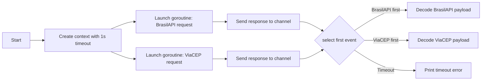

# Go Multithreading Challenge

## High-level Goal

This project demonstrates a classic concurrent systems pattern in Go: **race two external providers, return the first successful response, and enforce a strict timeout budget**.

Given a Brazilian CEP (postal code), the application queries two providers in parallel:

- BrasilAPI: https://brasilapi.com.br/api/cep/v1/{cep}
- ViaCEP: http://viacep.com.br/ws/{cep}/json/

The first provider to respond wins, the slower path is ignored, and the result is printed to the command line with the source provider.

## Why This Challenge Matters

From a hiring perspective, this exercise showcases practical backend skills beyond syntax:

- Concurrency primitives (`goroutines`, `select`, channels)
- Context propagation with deadlines (`context.WithTimeout`)
- I/O-bound orchestration over multiple external dependencies
- Fast-fail behaviour under tight latency constraints
- A clean, deterministic flow for handling timeout vs success paths

## Architecture Overview

The current implementation follows a lightweight fan-out/fan-in approach:

1. Create a context with a 1-second deadline.
2. Spawn one goroutine per provider request.
3. Each goroutine performs an HTTP GET using the shared context.
4. Use `select` to consume whichever response arrives first.
5. Decode and print the winning payload.
6. If no response arrives within the deadline, return timeout.

Conceptually:



## Key Design Decisions and Trade-offs

### 1. `context.WithTimeout` as global latency budget

- Decision: Use a single shared context for all outbound calls.
- Benefit: One place to control total request budget and cancellation.
- Trade-off: Both providers share the same deadline; no per-provider tuning yet.

### 2. Race strategy instead of fallback strategy

- Decision: Execute both requests concurrently from the start.
- Benefit: Reduces p95/p99 latency in unstable networks by taking the fastest path.
- Trade-off: Doubles outbound request volume for each lookup.

### 3. Separate response models per provider

- Decision: Keep dedicated structs (`AddressBrasilAPI`, `AddressViaCep`) rather than forcing early schema normalisation.
- Benefit: Preserves provider-specific fields and keeps decoding explicit.
- Trade-off: Caller-side output format is not yet unified.

### 4. Simplicity-first channels

- Decision: Use one channel per provider with `*http.Response` payload.
- Benefit: Keeps control flow straightforward for a coding challenge.
- Trade-off: Error details are currently collapsed (nil response), limiting observability.

## Current Behaviour

- Queries both providers simultaneously.
- Returns whichever API responds first.
- Prints response payload and source provider.
- Enforces a strict 1-second timeout.

## How to Run

### Prerequisites

- Go 1.21+ (recommended)
- Internet access to both public APIs

### Execute

```bash
go run main.go
```

## Example Output

```text
Response from ViaCEP:
{Cep:69304-350 Logradouro:... Bairro:... Localidade:... Uf:...}
```

or

```text
Response from BrasilAPI:
{Cep:69304-350 State:RR City:Boa Vista Neighborhood:... Street:... Service:...}
```

or

```text
Request timeout
```

## Engineering Notes (What I Would Improve Next)

For production readiness, the next iteration would include:

- Normalise both providers into a unified domain model.
- Return structured result+error envelopes through channels (instead of `nil`).
- Reuse a configured `http.Client` with transport-level timeouts and connection pooling.
- Validate HTTP status codes before decoding JSON.
- Add unit tests with `httptest.Server` to verify winner selection and timeout behaviour.
- Make CEP configurable via CLI arg or environment variable.
- Add simple metrics (winner provider, timeout count, latency histogram).

## Why This Project Is Relevant for Hiring Managers and Tech Leads

This repository is intentionally small, but it demonstrates strong fundamentals expected in backend Go roles:

- Ability to design concurrent flows that are easy to reason about
- Clear handling of latency budgets and cancellation
- Good awareness of distributed-systems trade-offs (speed vs cost, simplicity vs observability)
- Incremental architecture thinking: minimal viable implementation first, then hardening plan

If you would like, I can also provide a second README version focused on portfolio storytelling (less technical, more recruiter-friendly language) and keep this one as the engineering deep dive.